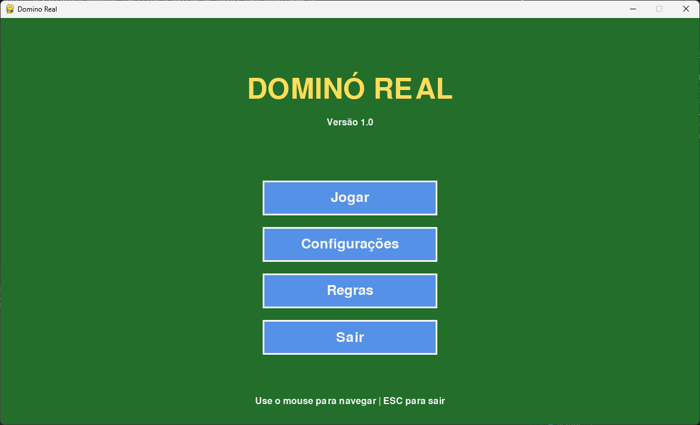
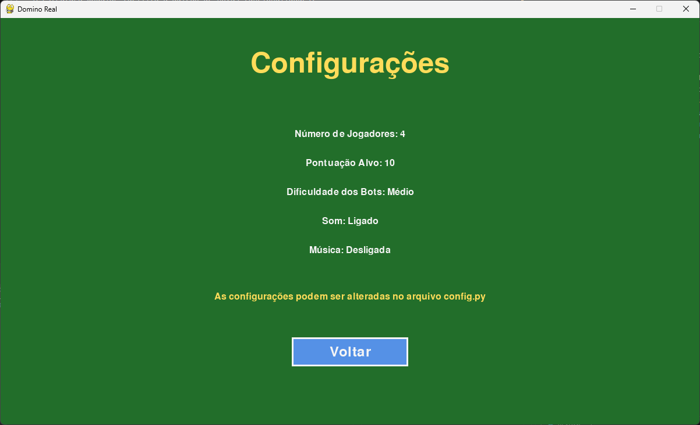
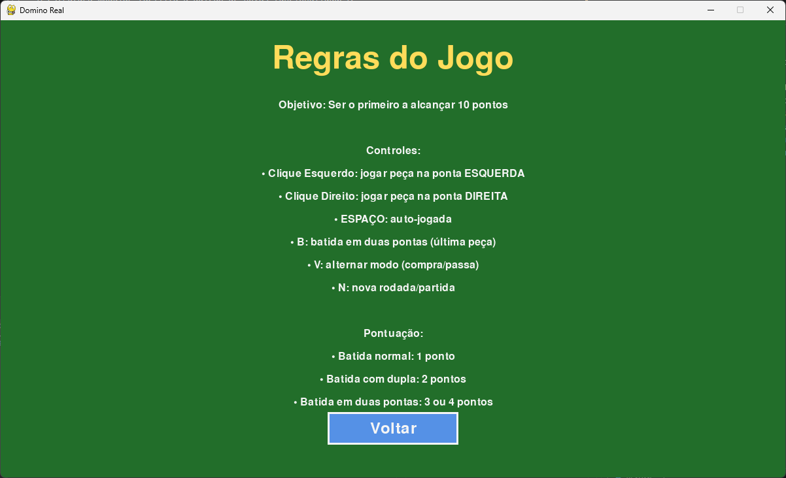
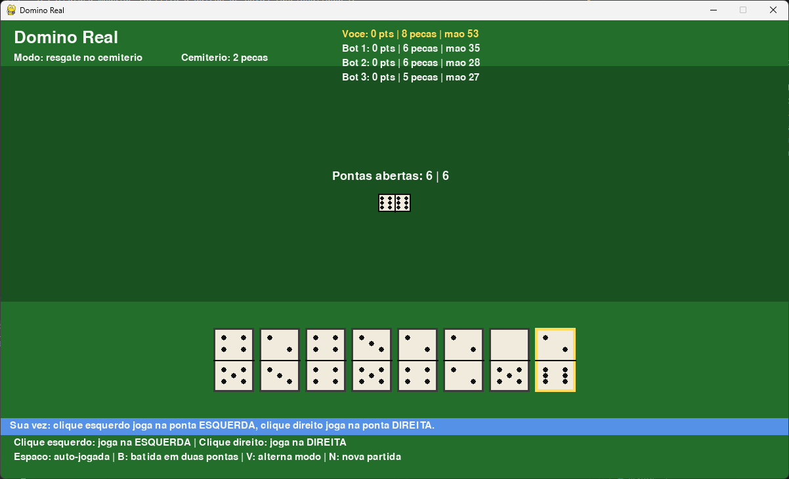

# 🎲 Domino Game (Python)

Jogo de dominó completo com interface gráfica desenvolvido em Python com Pygame. O jogo implementa as regras oficiais do dominó e inclui modo multiplayer local com bots inteligentes.


## ✨ Características:

- 🎮 **Menu principal interativo** com navegação intuitiva
- 🤖 **Inteligência artificial** para oponentes bots
- 🎵 **Sistema de sons** proceduralmente gerados
- 🎨 **Interface gráfica realista** com peças visuais (pintas desenhadas)
- 🎲 **Peças de dominó autênticas** com pontos ao invés de números
- 📊 **Sistema de pontuação** baseado nas regras oficiais
- ⚙️ **Configurações personalizáveis** via arquivo de configuração
- 🧪 **Testes unitários** incluídos
- 📖 **Código bem documentado** com docstrings completas

## 🎯 Características do Jogo:

### Modos de Jogo:

- **Modo Resgate**: Compra peças do cemitério até conseguir jogar
- **Modo Passa**: Passa a vez quando não pode jogar

### Regras Implementadas:

As regras seguem o manual oficial da Table Games:

- Partida com até 4 jogadores (1 humano + bots)
- Distribuição de 6 peças por jogador
- Início por duplo-6 ou maior peça
- Validação completa de encaixes
- Sistema de pontuação oficial:
  - Batida normal: 1 ponto
  - Batida com dupla (carroça): 2 pontos
  - Batida em duas pontas (simples): 3 pontos
  - Batida em duas pontas (dupla): 4 pontos
  - Jogo fechado: 1 ponto
- Meta de 10 pontos para vencer a partida

## 🎮 Controles:

No que diz respeito aos controles, o jogo é projetado para ser jogado principalmente com o mouse, mas também inclui atalhos de teclado para facilitar a jogabilidade:

### Menu:

- **Mouse**: Navegar e clicar nos botões
- **ESC**: Voltar/Sair

### Jogo:

- **Clique Esquerdo**: Jogar peça na ponta ESQUERDA
- **Clique Direito**: Jogar peça na ponta DIREITA
- **ESPAÇO**: Auto-jogada (joga automaticamente)
- **B**: Batida em duas pontas (quando tiver apenas 1 peça)
- **V**: Alternar modo (resgate/passa)
- **N**: Nova rodada/partida
- **ESC**: Voltar ao menu

## ⚙️ Requisitos:

Após a instalação das dependências, é necessário ter o Python 3.10 ou superior para executar o jogo. As dependências estão listadas no arquivo `requirements.txt` e podem ser instaladas usando pip.

- 🐍 **Python 3.10+**
- 📦 Dependências listadas em `requirements.txt`:
  - pygame 2.6.1
  - numpy 1.26.4
  - pytest 8.0.0 (para testes)

## 🚀 Como Executar:

### Instalação:

```bash
# Clone o repositório
git clone https://github.com/Victorkaue333/Domino_Game.git
cd Domino_Game

# Instale as dependências
pip install -r requirements.txt

# Execute o jogo
python run.py

# Ou diretamente:
python -m src.main
```

### Executar Testes

```bash
# Rodar todos os testes
pytest

# Rodar com cobertura
pytest --cov=src --cov-report=html

# Rodar testes específicos
python -m pytest tests/test_domino.py
python -m pytest tests/test_board.py
```

## 🗂️ Estrutura do Projeto:

O projeto está organizado em uma estrutura modular e profissional:

```text
Domino_Game/
├── src/                    # Código fonte principal
│   ├── __init__.py
│   ├── main.py            # Lógica principal do fluxo do jogo
│   ├── menu.py            # Menu principal e telas auxiliares
│   ├── board.py           # Lógica do jogo e renderização
│   ├── domino.py          # Classe de peças e geração do conjunto
│   ├── sounds.py          # Sistema de geração de sons
│   └── config.py          # Configurações centralizadas
│
├── tests/                  # Testes unitários
│   ├── __init__.py
│   ├── test_domino.py     # Testes para domino.py
│   └── test_board.py      # Testes para board.py
│
├── docs/                   # Documentação
│   └── Implementado.md    # Documentação de implementação
│
├── imgs/                   # Screenshots e imagens
│   ├── 1.png              # Menu principal
│   ├── 2.png              # Jogo em andamento
│   ├── 3.png              # Peças realistas
│   └── 4.png              # Interface completa
│
├── run.py                  # Script principal para executar o jogo
├── requirements.txt        # Dependências do projeto
├── README.md              # Este arquivo
├── CHANGELOG.md           # Histórico de versões
├── LICENSE                # Licença MIT
└── .gitignore             # Arquivos ignorados pelo Git
```

## ⚙️ Configurações:

Você pode personalizar diversos aspectos do jogo editando o arquivo `config.py`:

- Número de jogadores
- Pontuação alvo
- Cores da interface
- Velocidade dos bots
- Configurações de som
- Tamanhos de janela e fontes
- E muito mais!

## 🎨 Capturas de Tela:

<table>
  <tr>
    <td width="50%">
      
      <p align="center"><b>Menu Principal</b></p>
    </td>
    <td width="50%">
      
      <p align="center"><b>Jogo em Andamento</b></p>
    </td>
  </tr>
  <tr>
    <td width="50%">
      
      <p align="center"><b>Peças com Pintas Realistas</b></p>
    </td>
    <td width="50%">
      
      <p align="center"><b>Interface Completa</b></p>
    </td>
  </tr>
</table>

> 💡 **Destaques visuais**: Peças de dominó autênticas com pintas desenhadas, cores realistas e interface intuitiva.

## 🧪 Testes:

O projeto inclui testes unitários abrangentes organizados na pasta `tests/`:

- **test_domino.py**: Testa a lógica das peças (criação, encaixe, classificação)
- **test_board.py**: Testa jogadores, movimentos e lógica de jogo

Execute `pytest` na raiz do projeto para rodar todos os testes.

## 🛠️ Desenvolvimento:

### Estrutura do Código:

O código está organizado em módulos bem definidos dentro da pasta `src/`:

- **src/domino.py**: Classes e funções para peças de dominó
- **src/board.py**: Lógica do jogo, turnos e renderização visual
- **src/menu.py**: Interface de menus e navegação
- **src/sounds.py**: Geração procedural de sons
- **src/config.py**: Configurações centralizadas
- **src/main.py**: Fluxo principal entre menu e jogo

Todos os módulos possuem docstrings completas e seguem as melhores práticas de Python.

### Como Contribuir:

A estrutura modular facilita a adição de novas funcionalidades:

1. **Novos recursos de jogo**: Edite `board.py` ou `domino.py`
2. **Novos sons**: Adicione funções em `sounds.py`
3. **Novas configurações**: Adicione constantes em `config.py`
4. **Novos testes**: Crie arquivos em `tests/`
5. **Nova documentação**: Adicione em `docs/`


## 📄 Licença:

Este projeto está licenciado sob a Licença MIT - veja o arquivo [LICENSE](LICENSE) para detalhes.

## 👨‍💻 Autor

**Victor Kauê**

- GitHub: [@Victorkaue333](https://github.com/Victorkaue333)

---
